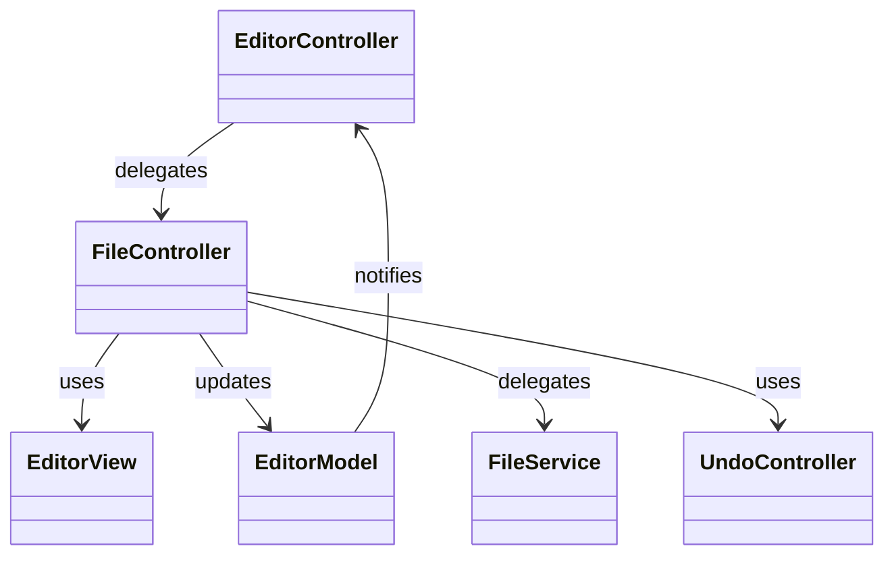
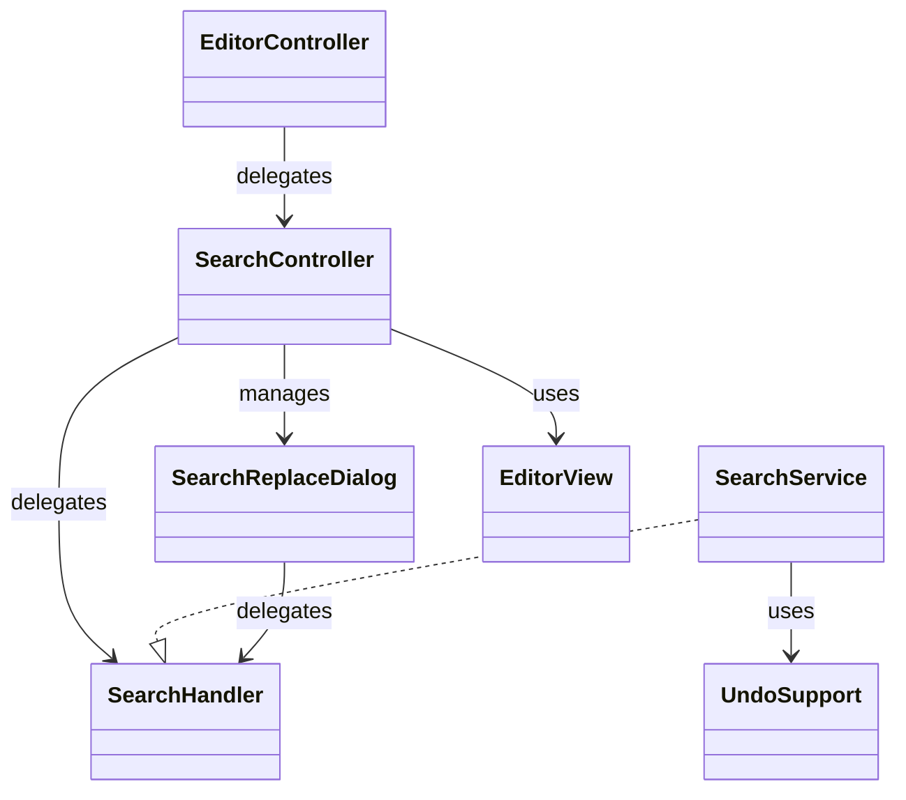
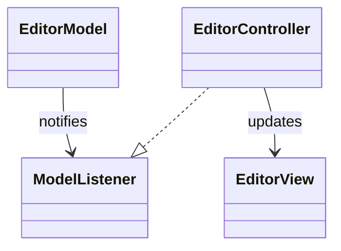
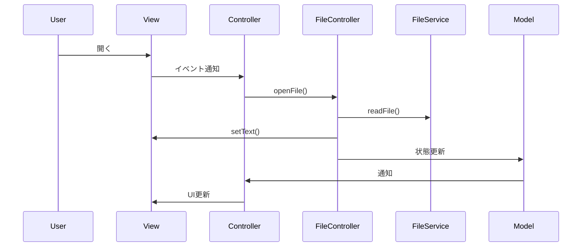
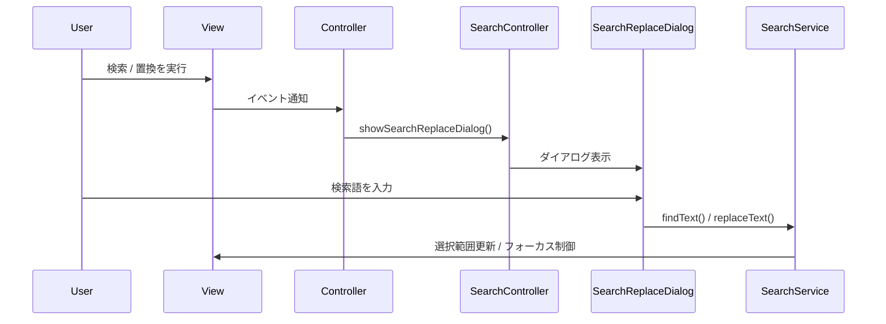

# TextEditor

Swingで開発したシンプルなテキストエディタです。  
基本的な編集機能に加え、検索・置換やUndo/Redoを実装しています。

設計面では、MVC志向をベースにController分割やService層の導入を行い、  
責務分離を意識して段階的に改善しました。

---

## ■ 主な機能

- ファイル操作（新規・開く・保存・名前を付けて保存）
- Undo / Redo
- 検索 / 置換（すべて置換は1回のUndoに対応）
- 行番号表示・ステータスバー
- 未保存変更の検知（タイトルに * 表示）

---

## ■ 技術的なポイント

- MVC志向の構成
- Controller分割による責務整理
- Service層による処理の分離
- Modelの状態管理と通知（Observer）
- EventHandlerによるイベント処理の分離
- Undo機構の実装（CompoundEdit）

---

## ■ パッケージ構成

```text
EditorMain              // アプリケーションのエントリーポイント

controller
├ EditorController      // アプリケーションの司令塔
├ EditorEventHandler    // Document・Caret イベントの検知
├ FileController        // ファイル操作の制御
├ SearchController      // 検索・置換の制御
└ UndoController        // Undo・Redoの制御

view
├ EditorView            // メイン画面描画
└ SearchReplaceDialog   // 検索・置換ダイアログ

model
└ EditorModel           // 状態管理（現在ファイル、未保存）

service
├ FileService           // ファイルIOロジック
├ SearchHandler         // 検索・置換IF
├ SearchService         // 検索・置換ロジック
└ UndoSupport           // Undo・Redo履歴の管理
```

---

## ■ クラス図（ファイル操作）



---

## ■ クラス図（検索・置換）



---

## ■ 状態通知



---

## ■ 処理フロー（ファイル読み込み）



---

## ■ 処理フロー（検索・置換）



---

## ■ 今後の改善
- 正規表現で検索
- 大文字小文字を無視した検索
- 設計のさらなる整理 (MVC + Service、クラス名やより細かい責務分離など)

---

## ■ 学習ポイント
- MVCに加えた責務分離の重要性
- 状態管理とUI更新の分離
- Swingの内部仕様（Documentの挙動）
- Undoの仕組みと設計

