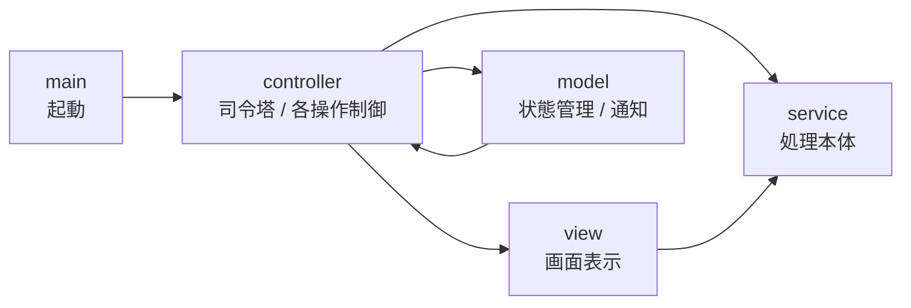
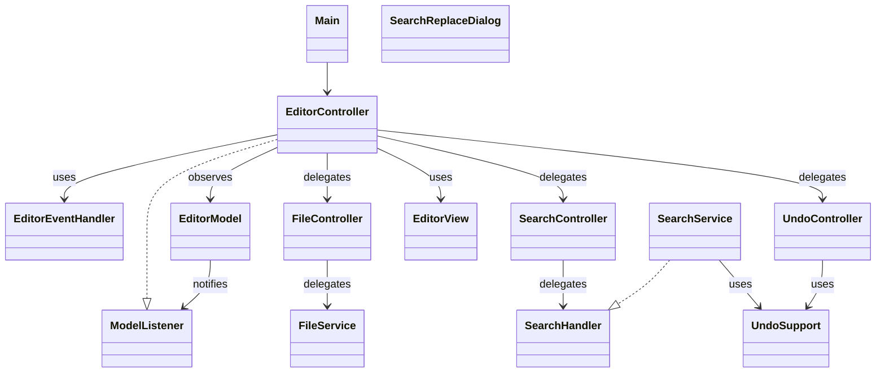
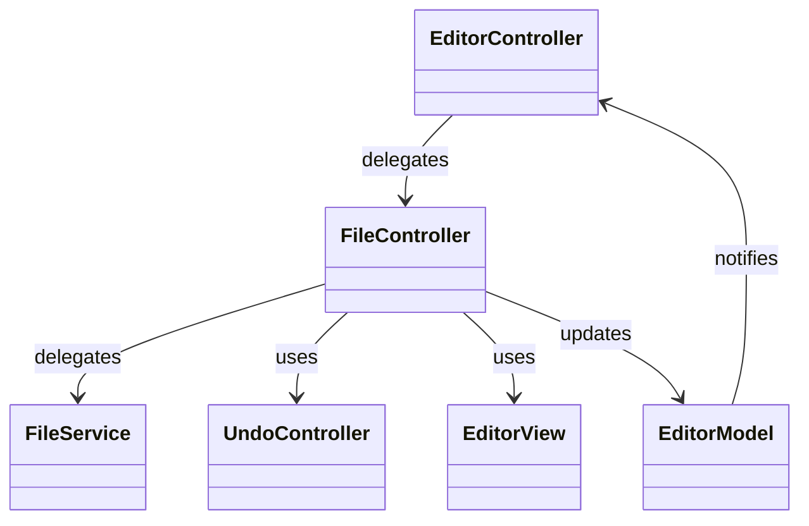
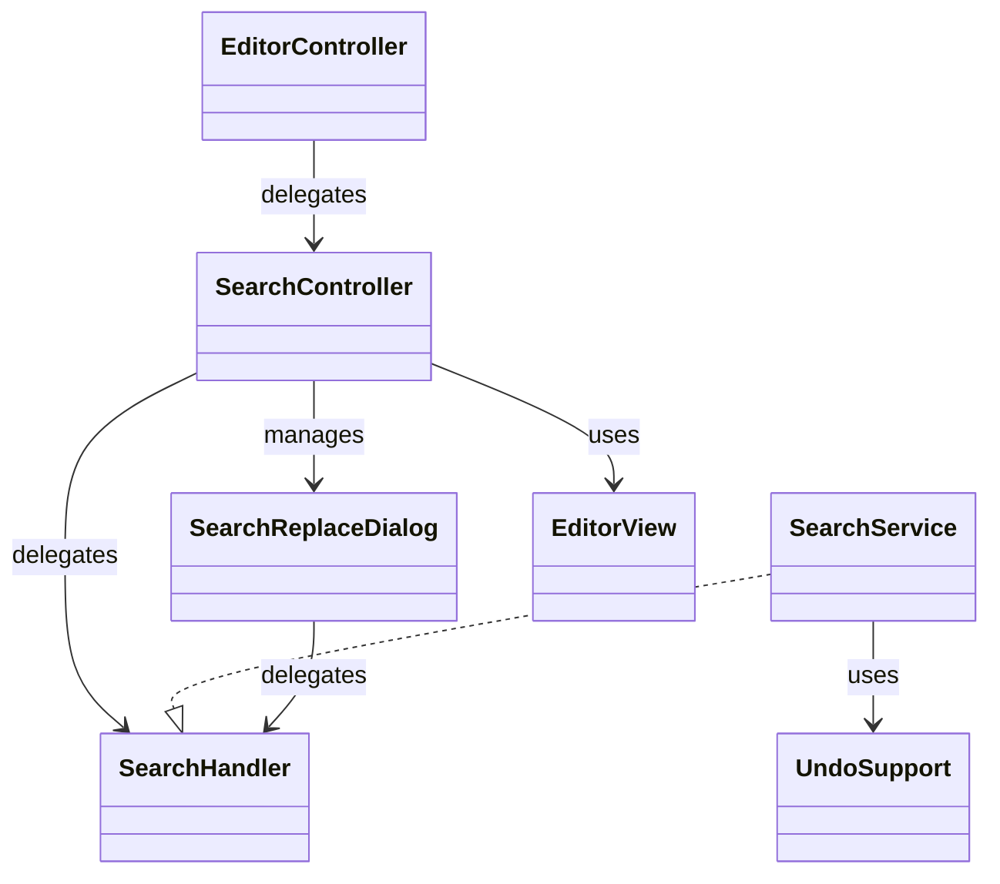
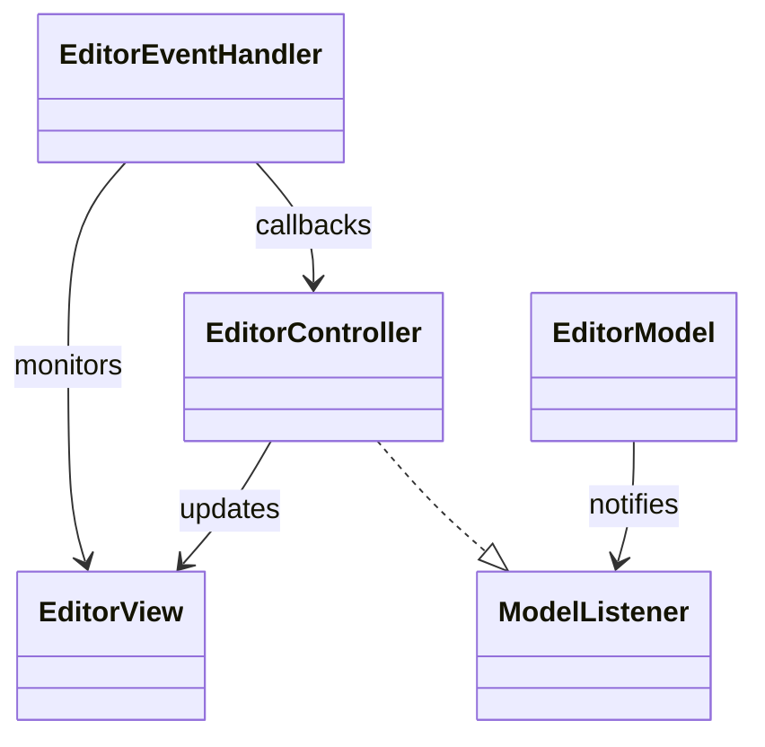
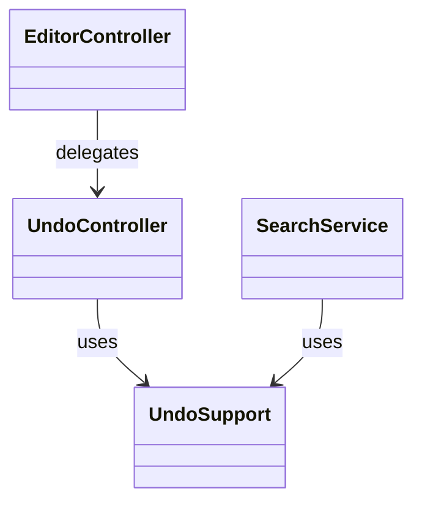
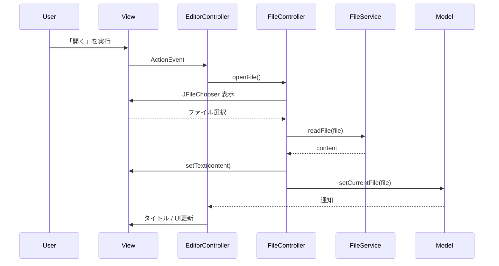

# TextEditor1Go

Swingを用いて開発したシンプルなテキストエディタです。  
基本的な編集機能に加え、検索・置換やUndo/Redoを備えています。  

本アプリでは、MVC志向の設計をベースに、  
Controller分割・Service層導入・イベント分離などを段階的に適用し、  
責務分離と設計改善を実践しています。

また、ChatGPTを活用してレビューや設計相談を行いながら開発を進めています。

---

## ■ 概要

本アプリは、Java学習の一環として開発したデスクトップアプリケーションです。  
以下のポイントで開発しました。

- 設計（責務分離・MVC）
- 段階的リファクタリング
- パッケージ単位で責務を分割し、構造を明確にする
- MVCに加えて、Controller分割とService層の導入により責務の明確化を行う
- Model通知の粒度分割とUI更新ハブにより、変更内容に応じた画面更新を実現
- UI更新をControllerに集約し、表示ロジックの一元管理を行う

---

## ■ 主な機能

### ● 基本機能
- 新規作成
- ファイル読み込み
- 上書き保存
- 名前を付けて保存
- Undo / Redo

### ● UI機能
- 行番号表示
- ステータスバー
  - 行番号 / 列番号
  - 総行数
  - 文字数
  - 選択文字数

### ● 検索・置換
- 検索（Ctrl+F）
- 次を検索（F3）
- 末尾まで検索後に先頭へループ

#### 置換機能
- 1件置換
- すべて置換（Undoを1操作にまとめる対応）

### ● その他
- 未保存変更の検知（タイトルに * 表示）
- 終了時の保存確認ダイアログ
- キーボードショートカット対応

---

## ■ 技術的なポイント

### ● アーキテクチャ
- MVC志向の構成
- Controller分割とService層の導入
- 責務分離と委譲

### ● 状態管理・通知
- Observerパターンの導入
- Model通知の粒度分割（currentFile / modified）
- UI更新ハブによる表示制御

### ● UI・イベント制御
- DocumentListenerによる変更検知
- Caret監視とステータスバー連動
- フォーカス制御・ショートカット競合対策
- EventHandlerによるイベント検知と処理の分離

### ● 機能実装
- UndoManagerとCompoundEdit
- indexOfベースの検索
- Document直接操作による置換
- UndoControllerによるUndo実行責務の分離

### ● その他
- Swing内部仕様の理解（Document差し替え）
- FileServiceによるI/O分離
- Modelに状態変更ロジック（markAsModifiedなど）を集約

---

## ■ パッケージ構成

```text
Main                     // アプリケーションのエントリーポイント  

controller
├ EditorController       // アプリケーション全体の司令塔（各Controller・Serviceの連携、Model通知の受信、UI更新の制御を担当）
├ EditorEventHandler     // Document / Caret イベントの検知を担当（実際の処理はControllerへコールバックで委譲）
├ FileController         // ファイル操作の流れを制御（新規作成・読み込み・保存・終了確認）
├ SearchController       // 検索・置換UIの制御  
└ UndoController         // Undo / Redo の実行を担当  

view  
├ EditorView             // メイン画面（テキストエリア・行番号・ステータスバー・メニュー）  
└ SearchReplaceDialog    // 検索・置換ダイアログ  

model  
└ EditorModel            // アプリケーションの状態管理（currentFile / modified）状態変更時はリスナーへ通知  

service  
├ FileService            // ファイル入出力の実装（読み込み・書き込み）  
├ SearchReplaceHandler   // 検索・置換処理のインターフェース  
├ SearchService          // 検索・置換ロジックの実装  
└ UndoSupport            // UndoManagerのラッパー、編集履歴の管理（CompoundEdit対応）  
```

---

## ■ パッケージ図（Mermaid）



---


## ■ アーキテクチャ概要

本アプリは、MVC志向をベースにController分割とService層を導入し、
責務分離を意識した構成としています。

---

### ● 全体構成



---

### ● ファイル操作



---

### ● 検索・置換



---

### ● イベント・状態通知



---

### ● Undo




---

## ■ シーケンス図（Mermaid）（ファイル読み込み）



---

## ■ 今後の改善予定

- Controller の責務整理のさらなる改善
- Service層の整理と拡張（File / Search以外への適用）
- Modelの責務強化（状態管理ロジックの集約）

### ● 機能
- 正規表現検索
- 大文字小文字無視検索

## ■ 学び
- MVCに加え、Controller分割とService層による責務分離
- Modelに状態変更ロジックを持たせる設計
- SwingのDocument挙動（差し替え / 使い回し）の違いによる設計影響
- イベント処理とビジネスロジックの分離（EventHandler導入）
- Undo機構の設計（CompoundEditによる一括操作）