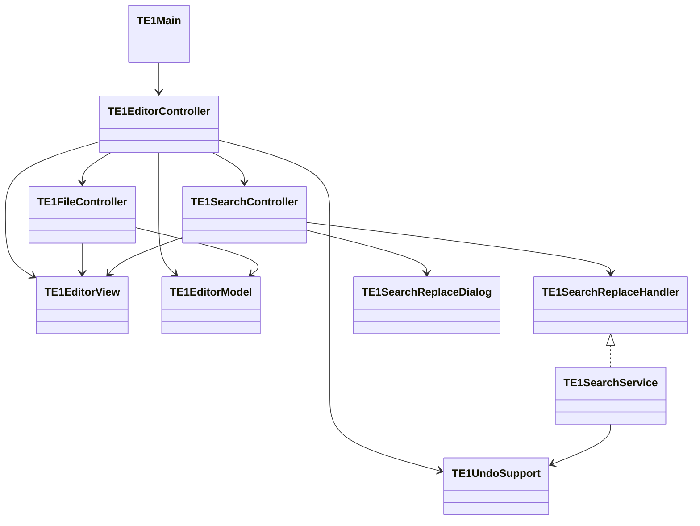

# TextEditor1Go

Swingを用いて開発したシンプルなテキストエディタです。  
基本的な編集機能に加え、検索・置換やUndo/Redoなどを備えています。  

機能追加とリファクタリングを繰り返しながら、  
設計改善（MVC志向）を学習することを目的としています。  

また、ChatGPTを活用してレビューや設計相談を行いながら開発を進めています。

---

## ■ 概要

本アプリは、Java学習の一環として開発したデスクトップアプリケーションです。  
単なる機能実装だけでなく、以下を意識して開発しました。

- 設計（責務分離・MVC）
- 段階的リファクタリング
- パッケージ単位で責務を分割し、構造を明確にする
- MVCに加えて、Controller分割とService層の導入により責務の明確化を行う

---

## ■ 主な機能

### ● 基本機能
- 新規作成
- ファイル読み込み
- 上書き保存
- 名前を付けて保存
- Undo / Redo

### ● UI機能
- 行番号表示
- ステータスバー
  - 行番号 / 列番号
  - 総行数
  - 文字数
  - 選択文字数

### ● 検索・置換
- 検索（Ctrl+F）
- 次を検索（F3）
- 末尾まで検索後に先頭へループ

#### 置換機能
- 1件置換
- すべて置換（Undoを1操作にまとめる対応）

### ● その他
- 未保存変更の検知（タイトルに * 表示）
- 終了時の保存確認ダイアログ
- キーボードショートカット対応

---

## ■ 技術的なポイント

### ● Documentモデルの活用
- DocumentListenerによる変更検知
- UI（行番号・ステータスバー）との連動

### ● Undo / Redo
- UndoManagerの利用
- CompoundEditによる「まとめUndo」の実装

### ● 検索・置換
- indexOfベースの検索アルゴリズム
- Document直接操作による置換処理

### ● 入力バリデーション
- null（キャンセル）対策
- 空文字の扱いの明確化

### ● UI制御
- フォーカス制御（requestFocusInWindow）
- invokeLater によるフォーカス問題の対策
- ショートカットキーの競合回避

### ● Observerパターンの導入
- Modelの状態変更をControllerが通知で受け取る構造を導入
- ViewはModelを直接参照せず、Controller経由で更新する構成とした

### ● Swing内部仕様の理解
- JTextArea.read(...) 実行後の Document 差し替えに伴うリスナー再登録対応

---

## ■ パッケージ構成

main  
└ TE1Main  
　└ アプリケーション起動

controller  
├ TE1EditorController  
│　└ 全体の制御、各Controllerの接続、Model通知の受信  
├ TE1FileController  
│　└ ファイル操作（新規作成、読み込み、保存、終了確認）  
└ TE1SearchController  
　└ 検索・置換UIの制御

view  
├ TE1EditorView  
│　└ 画面表示（テキストエリア、行番号、ステータスバー、メニュー）  
└ TE1SearchReplaceDialog  
　└ 検索・置換ダイアログ UI

model  
└ TE1EditorModel  
　└ 状態管理（currentFile, modified）

service  
├ TE1SearchReplaceHandler  
│　└ 検索・置換機能のインターフェース  
├ TE1SearchService  
│　└ 検索・置換ロジックの実装  
└ TE1UndoSupport  
　└ Undo 制御補助

---

## ■ クラス図（Mermaid）

---

## ■ 今後の改善予定

### ● 設計
- Controller の責務整理
- Model の責務強化
- Model通知の粒度の細分化（変更内容ごとの通知）
- クラス分割の最適化

### ● 機能
- 正規表現検索
- 大文字小文字無視検索
